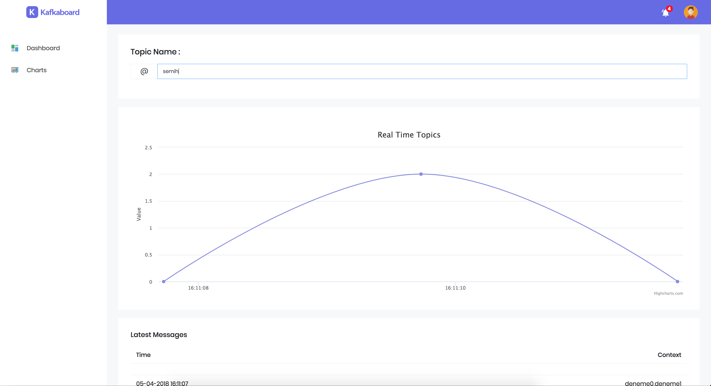

[](https://goreportcard.com/report/github.com/semihtok/Kafkaboard)

Kafkaboard
==========

Simple kafka dashboard for following streamed messages by topic.



How to use?
===========

Run at project directory:

```
$ go run main.go
```
or if you have Docker

```

$ docker run -d -p 8080:8080 himeslab/kafkaboard

```

After this application will start at "localhost:8080". As default, application listening local kafka port (localhost:9092)

## Using different IP

For different IP change helpers/KafkaHelper.go :

```go

conn, _ := kafka.DialLeader(context.Background(), "tcp", "YOUR_IP", topic, partition)

```

## Libraries used : 
- Beego (https://github.com/beego), 
- segmentio/kafka-go (https://github.com/segmentio/kafka-go)

## Dashboard template : 
- StarAdmin Free (https://github.com/BootstrapDash/StarAdmin-Free-Bootstrap-Admin-Template)

